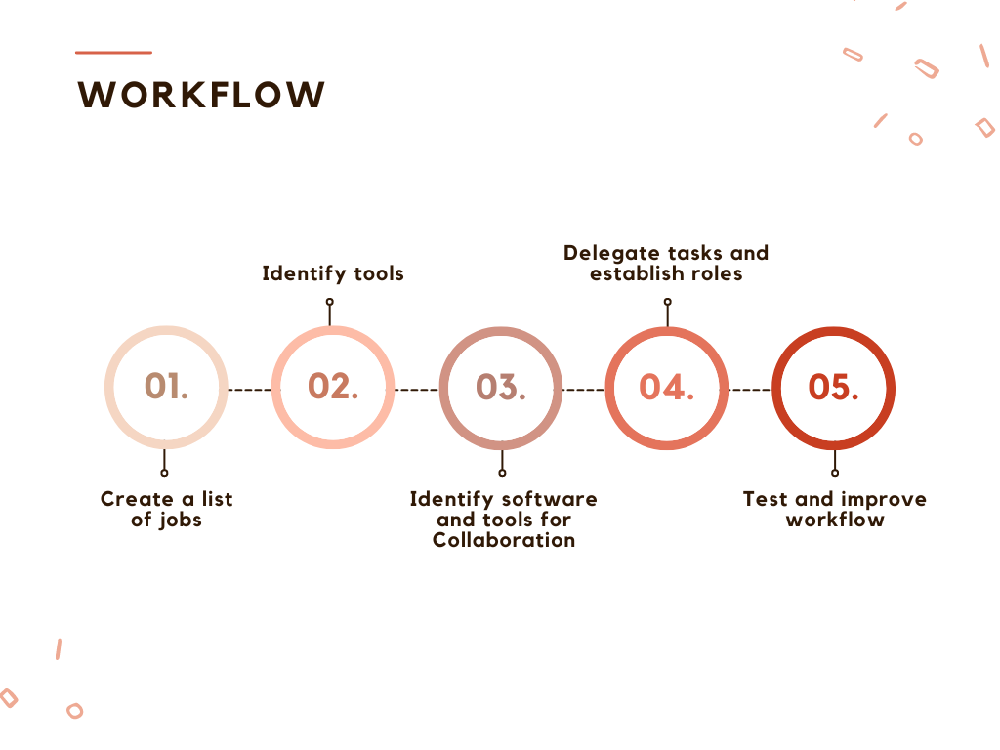

# Workflow

## 1. List of jobs to be done.

- Identify project scope
    - Goal: Provide a handy platform for students to predict their career based on various personal parameters and predict the potential salary in a particular job role.
    - Provide an easily accessible website for individuals working in industries looking for a change in job roles.
- Create a rough timeline for the project
    - [ ]  February 10th - February 15th - UI/UX (designing the website)
    - [ ]  February 16th - February 28th - Training the Machine Learning models.
    - [ ]  March 1st - March 9th - Frontend of the website.
    - [ ]  March 10th- March 20th - Backend of the website.
    - [ ]  March 20th- Integration of the Machine Learning models with the website.
    - [ ]  March 21st - April 9th- Alpha- Beta testing, Usability testing, and Interface testing, of the website.
    - [ ]  April 10th, 2023- Completed project.
- Skillset requirements
    - Data science engineer to develop ML models.
    - Full Stack Web Developer.
    - UI/UX developer
- List of potential risks and prevention
    - A potential risk of our website is an incorrect prediction of career or salary which may have a negative impact on our users.
    - To prevent this problem, we will be training our model such that we achieve optimum accuracy.

## 2. Tools needed to execute Tasks:

- UI/UX
    1. Google forms: Research for User Interface Requirements
    2. Figma- Initial Design
    3. Prototyping (to check the workflow and User Experience)
- Web Dev - Frontend
    1. React.js
    2. HTML
    3. CSS
    4. JS
- Web Dev - Backend
    1. Node.js
    2. Express.js
- AI/ML Model
    1. Dataset Identification
        1. [https://www.kaggle.com/datasets/adityapotdar23/students-career-prediction](https://www.kaggle.com/datasets/adityapotdar23/students-career-prediction)
        2. [https://www.kaggle.com/datasets/manishkc06/engineering-graduate-salary-prediction](https://www.kaggle.com/datasets/manishkc06/engineering-graduate-salary-prediction)
    2. Scikit Learn - Python (for preprocessing)
    3. Classification model for Career Prediction
        - Logistic Regression
        - Support Vector Machine (SVM) Model
        - K-Nearest Neighbors (KNN) Model
        - Decision Tree Classification
        - Random Forest Classification
        - XGBoost for Classification
    4. Regression Model for Salary Prediction
        1. Simple Linear Regression
        2. Multiple Linear Regression
        3. Polynomial Regression
        4. Support Vector Regression (SVR)
        5. Decision Tree Regression
        6. Random Forest Regression
        7. XGBoost for Regression
- Deployment of the Project
    1. Flask API - Python
    2. Hosting AI ML model on Heroku
    3. Linking Heroku API of the model with Node.js backend

## 3. Identify software and tools required to efficiently work as a team.

- Slack - a team collaboration and communication platform
    1. It allows for real-time messaging, file sharing, and organization of different work domain conversations into separate channels
    2. Slack has features such as audio and video calls, screen sharing, and customizable notifications to facilitate remote work, especially for college students to work from their hostels.
    3. It can also be used as a general forum for asking doubts, opinions and feedback of teammates on different tasks.
    4. All of our meetings, project discussions, doubts related to any individual domain etc. take place here.
- Notion - a productivity and organization tool
    1. It provides a flexible and customizable workspace for tasks, projects, and notes
    2. Notion has features such as task management, calendars, and templates to help users stay organized and efficient
    3. It helps each individual member to complete their tasks before their deadlines, in order to stay on track with the workflow timeline.
- GitHub - a web-based platform for version control and collaboration
    1. It allows us to store and manage our code repositories, track changes and collaborate with other members on projects.
    2. GitHub has features such as pull requests, issues tracking, and wikis to support project management.
    3. Facilitates multiple collaborators to efficiently work on code together by providing tools for commenting, reviewing, and merging code.
    4. All of our team members will be working on individual codes, and pushing them onto GitHub, so that each member can have a copy of the updated code, while simultaneously working on their own code.

## 4. Delegate the work.

[Work Division](Workflow%20c0a9ab21a5714336bc76c990de5844cd/Work%20Division%2082781270f73e4530b4ef478b7cd7e249.csv)

## 5. Test and improve workflow over time.
